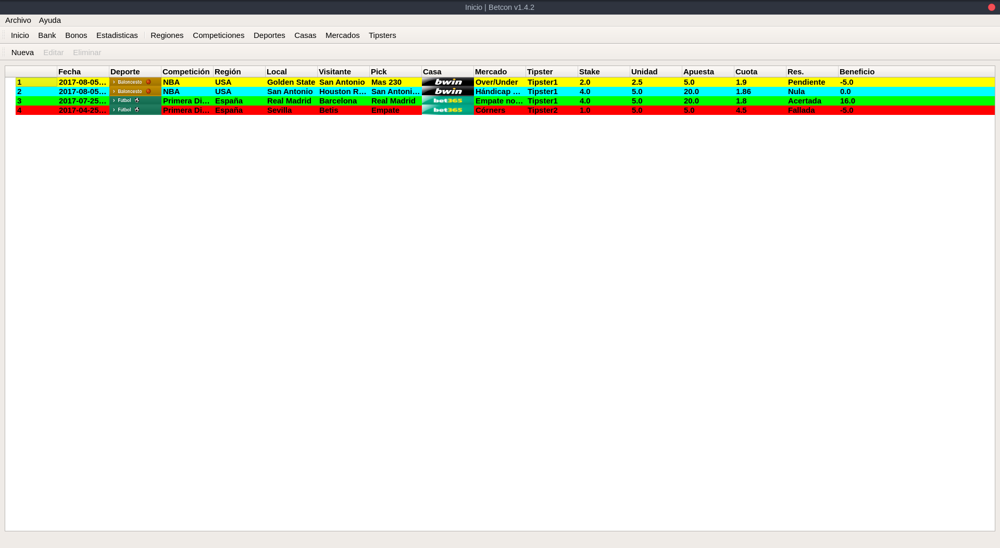

## Betcon

Betcon es una aplicación para sistemas GNU/Linux para la gestión de apuestas deportivas. Betcon tiene licencia GPLv3.

### Descargas

#### ArchLinux
Próximamente

#### Ubuntu
Próximamente

#### Código fuente

```
git clone https://github.com/soker90/Betcon.git
```

### Capturas de pantalla

#### Apuestas




### Contacto
Puedes contactarme en [eduparra90@gmail.com](mailto:eduparra90@gmail.com) o en [@soker90](http://twitter.com/soker90)


