## Betcon

Betcon es una aplicación para sistemas GNU/Linux y Windows para la gestión de apuestas deportivas. Betcon tiene licencia GPLv3.

### Descargas

#### ArchLinux
```bash
yaourt -S betcon
```

#### Debian/Ubuntu
[Descarga](https://github.com/soker90/betcon/releases/download/1.2.3/betcon_1.2.3-2_all.deb)

#### Instalar desde código fuente
Antes de instalar, asegúrate de tener instaladas las dependencias:
* Python3
* PyQt5
* SQLite3

Para instalar:
```
make install
```

#### Código fuente

```
git clone https://github.com/soker90/Betcon.git
```

#### Windows
[Descarga](https://github.com/soker90/betcon/releases/download/1.2.4/Betcon-1.2.4-Windows.exe)

### Capturas de pantalla

#### Apuestas


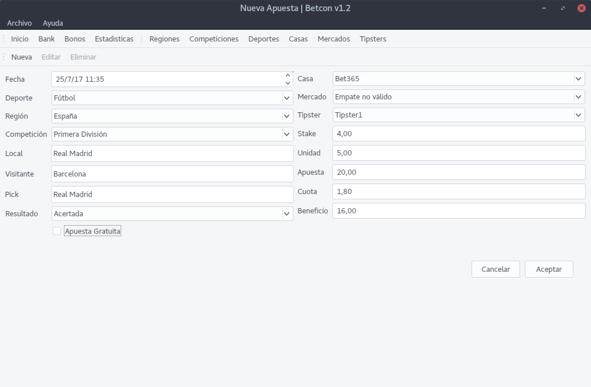

#### Bank

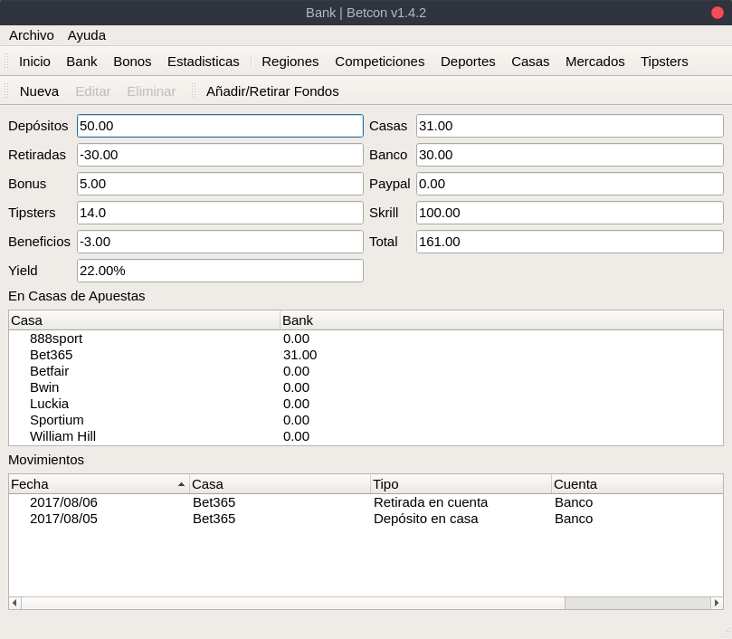

#### Bonos
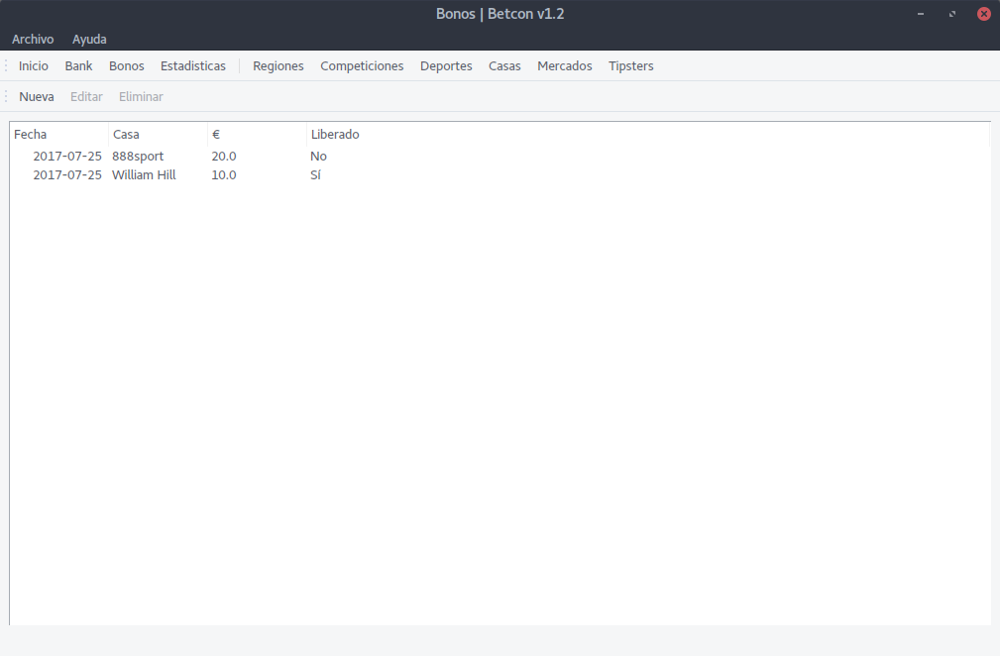

#### Estadisticas

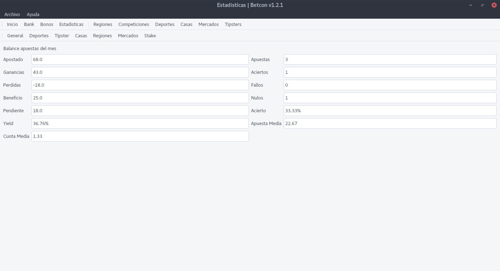

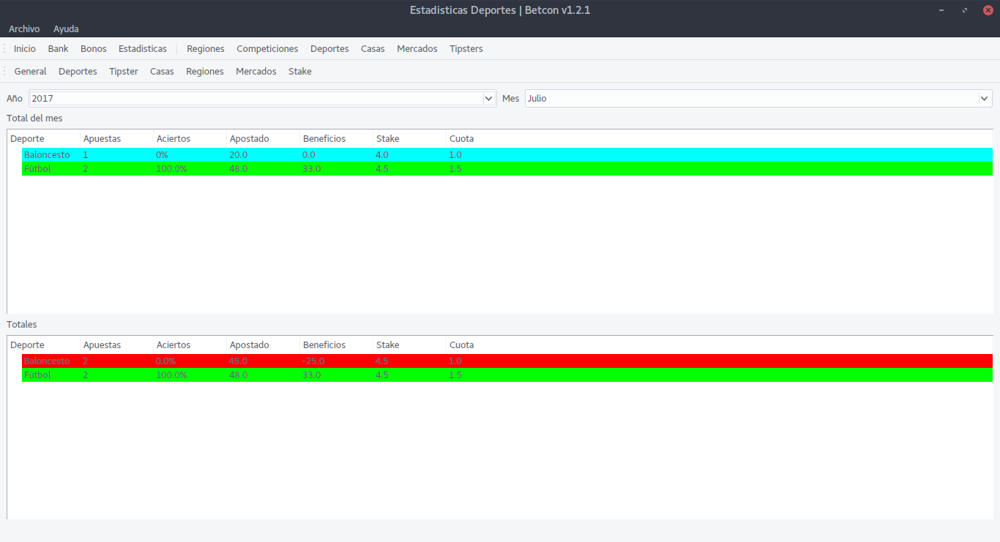

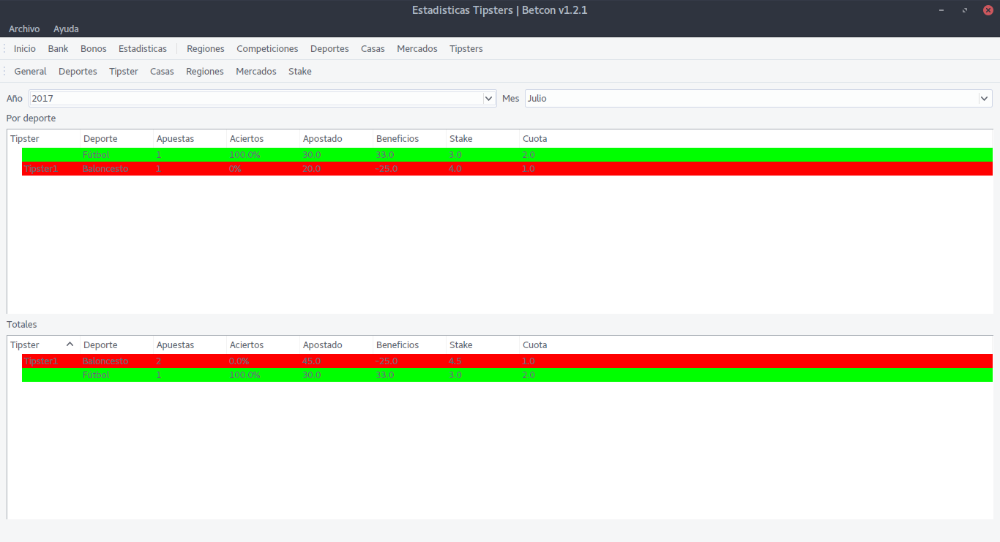

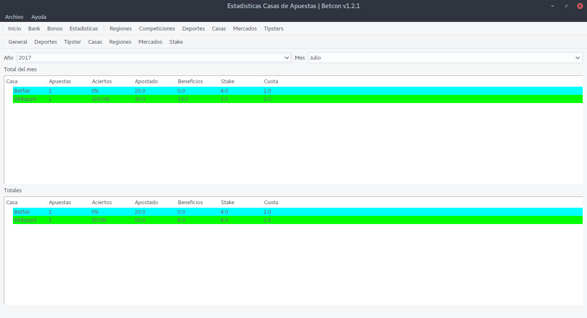


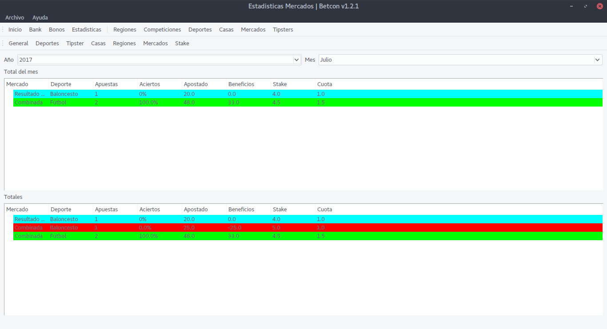

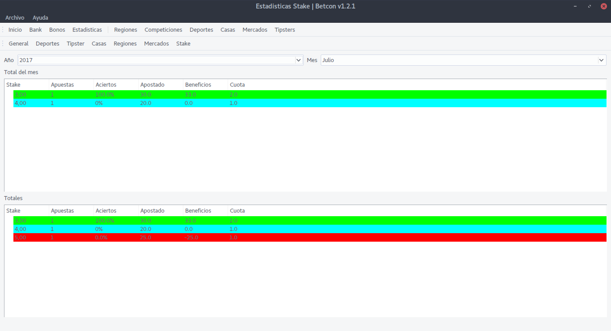

#### Regiones
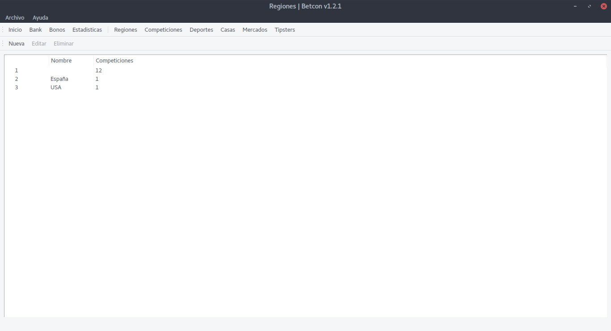

#### Competiciones
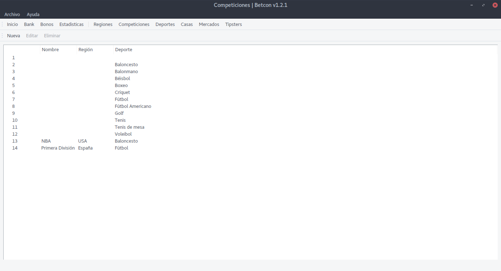

#### Deportes
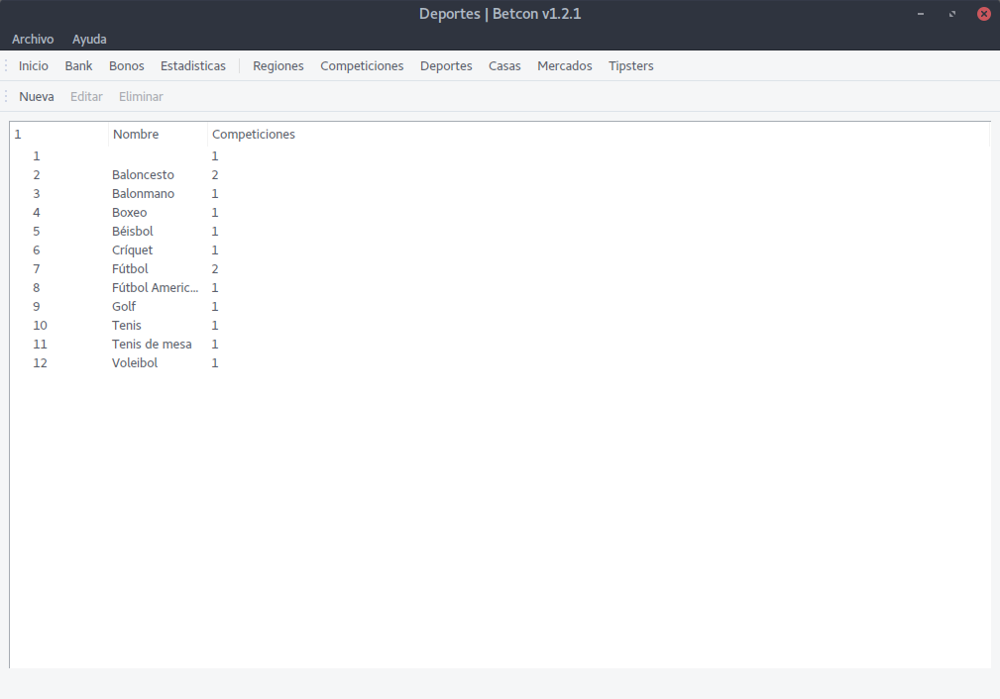

#### Casas de apuestas
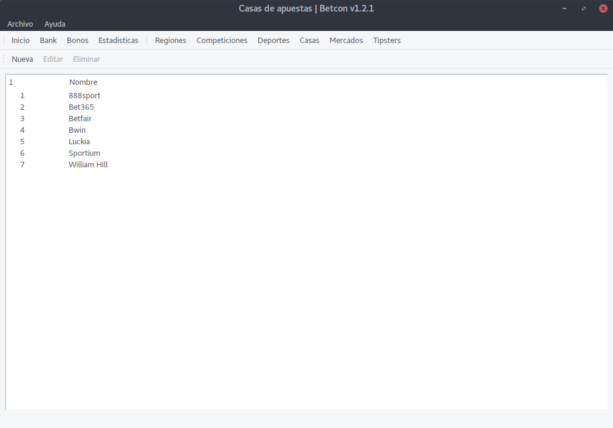

#### Mercados
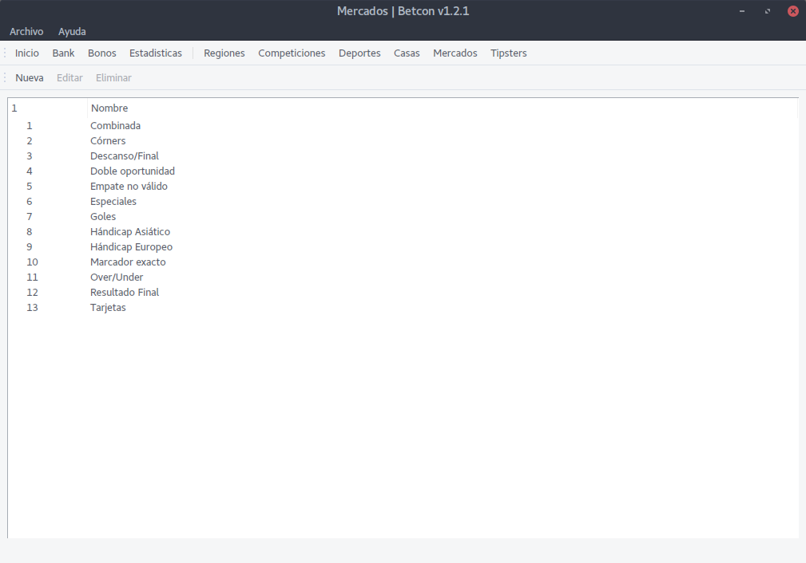

#### Tipsters
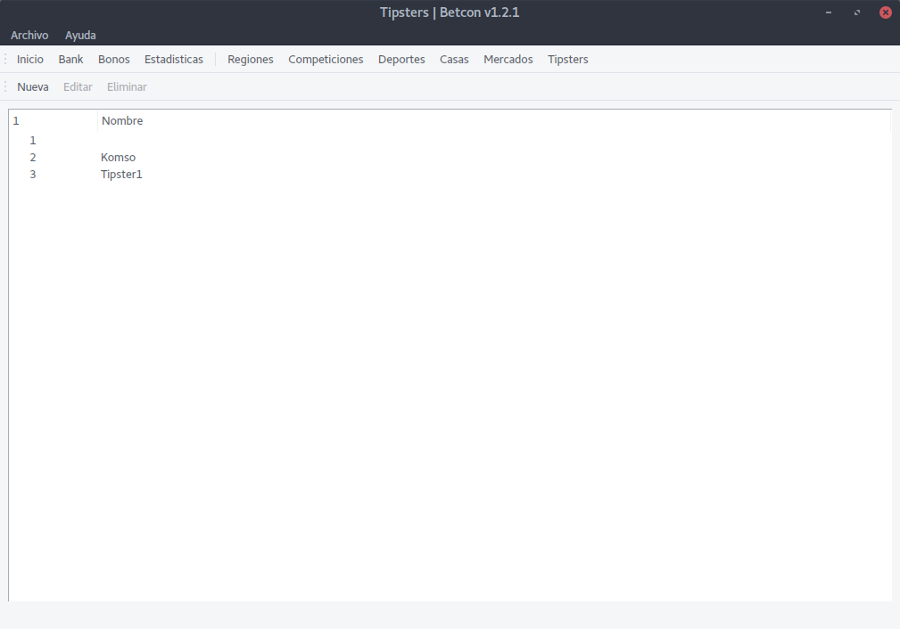


### Contacto
Puedes contactarme en [eduparra90@gmail.com](mailto:eduparra90@gmail.com) o en [@soker90](http://twitter.com/soker90).


